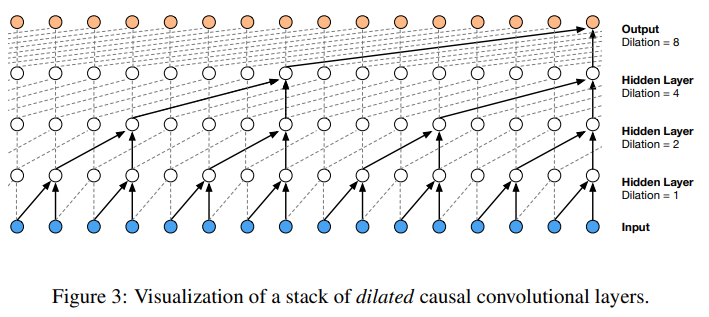

# HiFi-GAN 소개

NVIDIA 밋업에서 한국을 '보코더 강국'이라고 소개하는 것을 보고 약간 놀랐습니다.  
아마 그 이유 중 대부분은 2020년에 만들어졌지만 아직 SotA를 유지하고 있는 HiFi-GAN 때문이 아닐까 싶습니다.  
현존 보코더 중 최고의 성능을 자랑하는 HiFi-GAN을 소개합니다!

보코더가 굉장히 많긴 한데, 이중에서 제가 알고 있는 보코더만 간단하게 써보면

 

- WaveNet(2016, Google) : Dilated Convolution이 처음 나온 논문입니다. Autoregressive 형태입니다.
- WaveGlow(2018, NVIDIA) : WaveNet + Glow(Flow-based)
- MelGAN(2019, Mila) : GAN을 이용한 보코더의 시초가 되는 논문입니다.  
- VocGAN(2020, NCSoft / 한동대) : MelGAN의 아이디어에 생성자의 각 층에서 feature를 뽑아서 판별자를 적용합니다.
- HiFi-GAN(2020, Kakao Enterprise) : MelGAN의 아이디어인 MSD에 MPD라는 개념을 더해서 성능을 높였습니다.  

그 이후에도 Univ-Net이나 Avocodo 같은 보코더가 나왔지만, HiFi-GAN은 충분히 좋다고 생각합니다.  

일단 GAN에 대해서 간단하게 설명을 하겠습니다. 사실 발표를 위해 GAN을 좀 빡세게 공부하려고 했는데 시간이 부족했습니다.  

GAN은 일반적으로 generator(생성자)와 discriminator(판별자)로 이루어집니다.   
우리가 원하는 것은 생성을 잘하는 생성자이며, 생성자의 성능을 높이기 위해서 판별자가 쓰입니다.  
판별자는 생성자가 만들어낸 결과물은 0, 진짜 결과물은 1로 판단을 하게 훈련을 시키게 됩니다.  
일단 판별자와 생성자는 Convolution으로 이루어진 신경망이고(왜 그럴까요?) 아래와 같은 손실함수를 써서 훈련을 시키게 됩니다.  

- GAN loss

이진 분류 문제이므로 binary crossentropy loss를 사용해도 되겠지만, 여기서는 LS-GAN과 같은 아래와 같은 손실함수를 사용합니다.  

$$L_{adv} (D; G) = \mathop{\mathbb{E}}_{(x, s)}[(D(x)-1)^2 + (D(G(s)))^2]$$

생성자는 판별자를 속여야(즉, D(G(s))가 1이라는 판정을 받아야) 좋은 생성자이므로, 아래와 같은 손실함수를 사용합니다.

$$L_{adv} (G; D) = \mathop{\mathbb{E}}_{s}[(D(G(s)) -1)^2] $$

여기서 $\mathop{\mathbb{E}}$는 기대값을 나타내며, x는 진짜 결과물인 ground truth, s는 generator에 의해 생성된 결과물입니다.  

이게 일반적인 GAN의 손실함수인데, 생성자의 성능을 높이기 위해서 다른 로스를 추가로 사용합니다.  

- Mel-Spectrogram loss

생성자는 진짜 결과물의 mel-spectrogram과의 L1-loss를 계산합니다.

$$L_{mel} (G) = \mathop{\mathbb{E}}_{(x, s)}[||\phi(x) - \phi(G(s))||_1]$$

여기서 $\phi$는 mel-spectrogram을 얻는 함수로 보시면 됩니다.  

- Feature Matching loss

판별자는 여러 층으로 구성되어있는데, 각 층마다 원본과 생성자에서 뽑아낸 feature들의 L1-loss를 계산합니다.  

$$L_{FM} (G; D) = \mathop{\mathbb{E}}_{(x, s)}[\sum_{i=1}^{T}\frac{1}{N_i}||D^i(x) - D^i(G(s))||_1]$$

판별자가 T개의 층으로 구성되어있을 때 $D^i$는 판별자의 i번째 계층에서 나온 결과값을 의미합니다.

최종적으로, 생성자는 GAN loss, Mel-Spectrogram loss, Feature Matching loss를 섞어서 사용하게 되고, 판별자는 GAN loss를 사용합니다.  

$$L_G = L_{Adv}(G;D) + \lambda_{FM}L_{FM}(G;D)+ \lambda_{mel}L_{mel}(G)$$

$$L_D = L_{Adv}(D;G)$$

그럼 이제 HiFi-GAN에서 사용한 키 아이디어를 알아보도록 하겠습니다.   

HiFi-GAN은 두 개의 판별자를 사용하는데, MelGAN에서 사용한 MSD와 음성을 일정 간격으로 모아서 2D로 만든 MPD를 사용합니다.   
두 판별자 모두 Convolution으로 이루어져 있고, 음성이나 mel-spectrogram이 신경망을 통과하며 사이즈가 어떻게 변하는가 살펴보겠습니다.

- MSD(Multi-Scale Discriminator)

기본적으로 들어온 음성과 음성에 pooling을 한 번/두 번 적용한 것까지 총 세 개의 입력 feature에 대해 convolution을 적용한 후 판별합니다.  
아래에서 다룰 MPD와는 달리 연속적인 신호를 다루게 됩니다.  

- MPD(Multi-Period Discriminator)

음성을 특정 주기(2, 3, 5, 7, 11의 소수 주기) 별로 나눈 2D 데이터에 대해서 convolution을 적용한 후 판별합니다.  
각각의 주기를 독립적으로 다루기 위해서 kernel size는 1이 됩니다.  
대부분의 GAN 보코더는 MSD를 어떤 형태로건 쓰고 있으므로, MPD를 HiFi-GAN의 최대 아이디어로 보는 것 같습니다. VITS에서도 씁니다.  

- Generator  

 

가장 왼쪽에 보이는게 upsample 모듈이며, 보여드릴 v3 버전에서는 <b>3번의 upsample이 8배, 8배, 4배</b>로 이루어집니다.  
(v1, v2 버전에서 달라질 수 있는 변수들은 볼드 처리하겠습니다. v1이 성능이 제일 좋으며 v3이 제일 처리 속도가 빠릅니다.)  
한 번의 upsample에서 이루어지는 과정을 하나씩 살펴보면  

1. ConvTranspose를 이용한 크기 upsample  
1. MRF 모듈 적용  

그림 가운데의 MRF 모듈은 <b>3개의 ResBlock2</b>의 출력값의 평균을 취하며, 각 블록의 <b>kernel size와 dilation</b>이 달라서 다른 정보를 읽어오게 됩니다.  
<b>ResBlock2는 2개의 Leaky ReLU + Conv1D</b>로 구성되어있습니다. ResNet에서 본 Skip-Connection 쓰는 그 블록 맞습니다!

이렇게 만들어진 HiFi-GAN의 성능이 다른 보코더를 아득하게 넘어섰고 지금도 paperswithcode의 SotA 모델을 기록하고 있습니다.  
그 이후에 카카오 엔터프라이즈에서 나온 모델인 VITS에서도 MPD, MPS를 그대로 사용하고 있습니다.    
심지어 마이크로소프트에서도 HiFi-GAN을 카피한 HiFi-Net을 Azure TTS에 쓰고 있다고 블로그에서 밝혔습니다.  

뭐라고 끝맺어야 좋을지 잘 모르겠군요.. 들어주셔서 감사합니다.  
